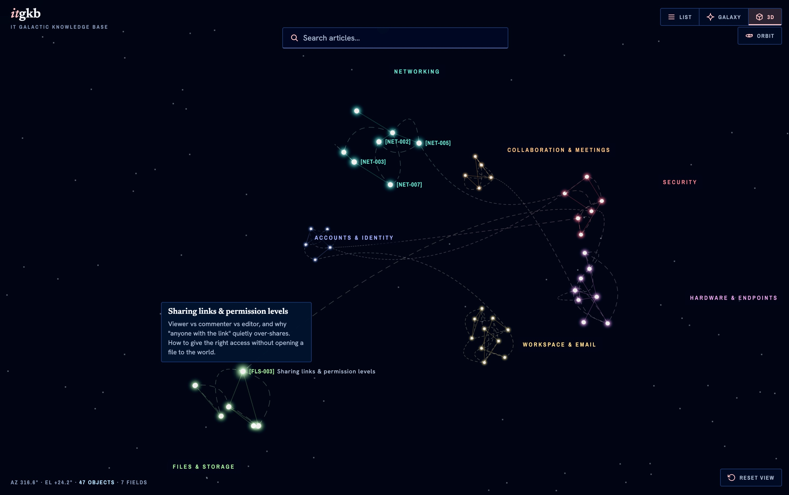

# IT Knowledge Galaxy

[](https://github.com/gidde032/itgkb/actions/workflows/ci.yml)

**▶ Live demo: https://gidde032.github.io/itgkb/**



An explorable, vendor-neutral IT knowledge base rendered as a galaxy: every
article is a star, stars cluster into constellations by category, and proximity
means topical similarity. A revision-pinned MiniLM model computes the default
layout at build time; no model, API key, or server ships to the browser. Part
Wikipedia, part star chart.

## Run it

```bash
git clone https://github.com/gidde032/itgkb.git
cd itgkb
npm install
npm run dev
```

Open the printed localhost URL.

**Finding articles fast:** type in the search bar — non-matching stars and
lines dim in place. Build-time MiniLM embeddings re-rank results by semantic
similarity, surfacing related articles even when terms only partially match.
Press Enter to jump to the top match, Escape to clear. In galaxy and 3D modes
a dropdown below the search bar shows ranked results — ArrowDown to enter,
click to fly to a star and open its article. In list mode the view flattens
into a single ranked list while a query is active and restores constellation
grouping when cleared. On narrow screens (<900 px) the list is shown
automatically.

Click a star to read its article. Drag to pan, scroll to zoom, "Reset view" to
return home.

**Related-article lines:** dashed lines connect articles that reference each
other in their `related` frontmatter, colored as a gradient from the source
constellation to the target constellation. Click a star to emphasize its
related lines, press `R` (or the "Related lines" button, top right) to show
every related line at once. The default-off setting is shared by the 2D and 3D
views; with it off, selecting a star still reveals that star's related lines.

**Semantic constellation lines:** the default layout groups articles by meaning
and connects every star in each group through a similarity-favoured open path,
with no more than two lines per star. The 3D globe consumes the committed
semantic positions directly; the 2D galaxy applies a deterministic readability
pass that preserves constellation membership, local group shape, and path
topology while separating crowded group footprints. If that artifact is
unusable, the app falls back to the curated tag-and-anchor layout.

**3D view:** the view switcher (List · Galaxy · 3D) adds a three-dimensional
showcase. Stars expand into depth based on constellation `depth` settings;
related-article arcs curve through space and constellation lines carry over
from the 2D galaxy. Hover for tooltips, click to open the article panel,
drag to orbit, scroll to zoom — the AZ/EL readout tracks your camera. The 3D
segment is hidden automatically if WebGL is unavailable. The renderer is
lazy-loaded and does not affect the initial page load.

## Add or edit an article

1. Copy `content/TEMPLATE.md` into `content/articles/<your-id>.md`. The filename
   must match the frontmatter `id` (e.g. `clear-stale-port.md` →
   `id: clear-stale-port`).
2. Fill in the frontmatter (`id`, `title`, `constellation`, `tags`, `summary`)
   and the body sections. Leave `related` empty (`[]`) or list ids of articles
   that already exist — unresolvable ids fail validation.
3. `npm run validate:content` — fix anything it flags.
4. `npm run build:semantic` — regenerate `content/semantic-map.json` and
   `content/semantic-vectors.json` (the first run downloads the pinned model
   into the gitignored `.cache/` directory).
5. Reload the dev server. Your star is in the galaxy.

`constellation` must be one of the ids in `content/constellations.json`
(`workspace-email`, `collaboration-meetings`, `files-storage`, `networking`,
`accounts-identity`, `hardware-endpoints`, `security`). That file also holds each
constellation's display name, catalog prefix, anchor position, and accent color.

**Vendor-neutral content.** Public articles are organization-agnostic: no
employer/team names, internal hostnames, intranet URLs, or PII.
`npm run check:sensitivity` reports violations.

## Development

- `npm run gates` — full quality gate: format check, typecheck, lint, tests +
  coverage floor, content validation, and a production build. Must be green
  before merging. CI (`.github/workflows/ci.yml`) runs the same gate on every
  push and PR; the Pages deploy (`.github/workflows/deploy.yml`) re-runs the
  quality gates before publishing, so a red build can't ship.
- `npm run gates:quality` — the gate chain without the build (used by the deploy
  job, which builds separately with the Pages base path).
- `npm test` — test suite only.
- `npm run build:semantic` — regenerate both committed semantic artifacts
  (`semantic-map.json` and `semantic-vectors.json`) after changing an article
  title, summary, tags, or authored constellation.
- `npm run check:semantic` — validate both artifact schemas and input freshness
  without loading the model or requiring network access.
- `npm run check:sensitivity` — content-sensitivity gate: no org-specific data,
  internal hostnames, or unresolved `(verify)` markers. Hard gate in `gates`.

## Architecture

Three layers, deliberately decoupled so the visual front end never depends on
where positions or search results come from:

- **Content pipeline.** Articles are markdown files in `content/articles/` with
  validated YAML frontmatter (schema in `SPEC.md` §5). `npm run validate:content`
  is the gate; nothing hardcodes article bodies in components.
- **Provider seams.** Layout and search sit behind provider interfaces. The
  default `SemanticLayout` consumes a committed build artifact; the
  `CuratedForceLayout` remains its automatic fallback. Both yield the same plain
  star-position contract. `SemanticTextSearch` wraps `TextSearch` with cosine
  re-ranking from committed embedding vectors, falling back to plain text when
  vectors are unavailable — same artifact + fallback pattern as layout.
- **Renderers.** Three view modes share the canonical layout data and match
  state: the 2D galaxy (default), a flat list, and a lazy-loaded 3D showcase
  (WebGL-gated, ~236 KB gz). The 2D renderer may reflow presentation geometry
  for readability; the 3D renderer uses canonical positions. None of them
  inspect article bodies.

The visual system (color, type, the cartographic "instrument" layer of catalog
IDs and a coordinate HUD) is defined in `design/DESIGN.md`; `design/tokens.css`
is the ratified design reference, and `src/styles.css` holds the implemented
token subset.

See `SPEC.md` for full scope and the extensibility contracts.
